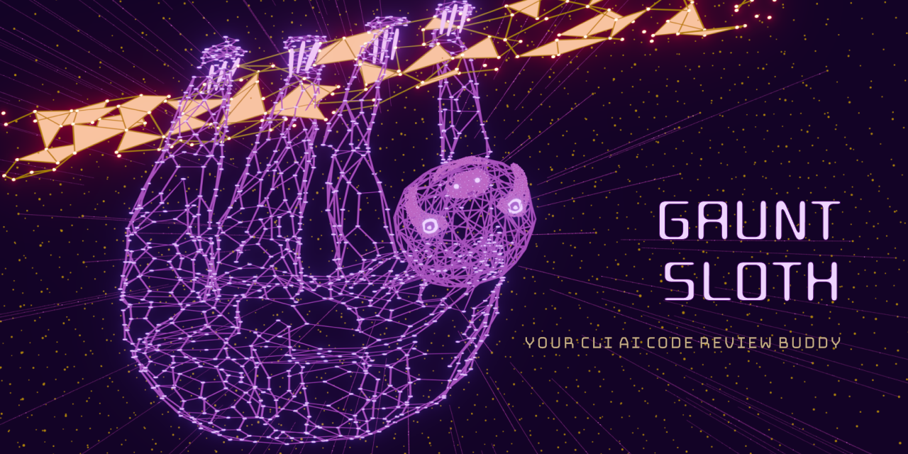

# Gaunt Sloth Assistant
[](https://github.com/andruhon/gaunt-sloth-assistant/actions/workflows/ci.yml)

Gaunt GSloth Assistant is a lightweight **command line AI assistant** for software developers
designed to enhance code review quality while reducing cognitive load and time investment on **code reviews**
and pull request diff analysis.



Based on [Langchain.js](https://github.com/langchain-ai/langchainjs)

## What GSloth does:
- Reviews code;
  - Suggests bug fixes;
  - Explains provided code
- Reviews Diffs provided with pipe (|);
  - You can ask GSloth to review your own code before committing (`git --no-pager diff | gsloth review`).
- Reviews Pull Requests (PRs) (`gsloth pr 42`);
  - Fetches descriptions (requirements) from Github issue or Jira (`gsloth pr 42 12`);;
- Answers questions about provided code;
- Writes code;
- Saves all responses in .md file in the project directory;
- Anything else you need, when combined with other command line tools.

## Why?

While there are many powerful AI assistants available, Gaunt Sloth Assistant stands out by providing developers with:

1. **Provider flexibility** - Freedom to choose and switch between different AI providers (Google Vertex AI, Anthropic, Groq) based on your specific requirements, performance needs, or compliance policies
2. **Open-source transparency** - Complete visibility into how your code and data are processed, with no vendor lock-in
3. **Command-line integration** - Seamless workflow integration with existing developer tools and processes
4. **Specialized focus** - Purpose-built for code review and PR analysis rather than general-purpose assistance
5. **Extensibility** - GSloth is based on LangChain JS and can be easily extended, configured or augmented in different ways.
6. **Model Context Protocol (MCP)** - Support for MCP allows for enhanced context management.
7. **Cost Effectiveness** - When agentic tools will send a number of requests to figure out a user's intent burning thousands of tokens, gsloth simply sends your diff prefixed with guidelines for review.

Unlike proprietary solutions that restrict you to a single AI provider, Gaunt Sloth empowers developers with choice and control while maintaining the specialized capabilities needed for effective code review.

### To make GSloth work, you need an **API key** from some AI provider, such as:
- Google Vertex AI;
- Anthropic;
- Groq.

## Commands Overview

`gth` and `gsloth` commands are used interchangeably, both `gsloth pr 42` and `gth pr 42` do the same thing.

For detailed information about all commands, see [docs/COMMANDS.md](./docs/COMMANDS.md).

### Available Commands:

- **`init`** - Initialize Gaunt Sloth in your project with a specific AI provider
- **`pr`** - ⚠️ This feature requires GitHub CLI to be installed. Review pull requests with optional requirement integration (GitHub issues or Jira).
- **`review`** - Review any diff or content from various sources
- **`ask`** - Ask questions about code or programming topics
- **`chat`** - Start an interactive chat session
- **`code`** - Write code interactively with full project context

### Quick Examples:

**Initialize project:**
```shell
gsloth init anthropic
```

**Review PR with requirements:**
```shell
gsloth pr 42 23  # Review PR #42 with GitHub issue #23
```

**Review local changes:**
```shell
git --no-pager diff | gsloth review
```

**Ask questions:**
```shell
gsloth ask "What does this function do?" -f utils.js
```

**Interactive sessions:**
```shell
gsloth chat  # Start chat session
gsloth code  # Start coding session
```

## Installation

Tested with Node 22 LTS.

### NPM
```shell
npm install gaunt-sloth-assistant -g
```

## Configuration

> Gaunt Sloth currently only functions from the directory which has a configuration file (`.gsloth.config.js`, `.gsloth.config.json`, or `.gsloth.config.mjs`) and `.gsloth.guidelines.md`.
> Global configuration to invoke gsloth anywhere is in [ROADMAP](ROADMAP.md).

Configuration can be created with `gsloth init [vendor]` command.
Currently, vertexai, anthropic and groq can be configured with `gsloth init [vendor]`.

More detailed information on configuration can be found in [CONFIGURATION.md](./docs/CONFIGURATION.md)

### Google Vertex AI
```shell
cd ./your-project
gsloth init vertexai
gcloud auth login
gcloud auth application-default login
```

### Anthropic

```shell
cd ./your-project
gsloth init anthropic
```

Make sure you either define `ANTHROPIC_API_KEY` environment variable or edit your configuration file and set up your key.

### Groq
```shell
cd ./your-project
gsloth init groq
```
Make sure you either define `GROQ_API_KEY` environment variable or edit your configuration file and set up your key.

### Other AI providers
Any other AI provider supported by Langchain.js can be configured with js [Config](./docs/CONFIGURATION.md). 

## Contributing
Contributors are needed! Feel free to create a PR.
If you are not sure where to start, look for issues with a "good first issue" label.

## Building from repo
See [DEVELOPMENT.md](./docs/DEVELOPMENT.md)

## License
License is [MIT](https://opensource.org/license/mit). See [LICENSE](LICENSE)
